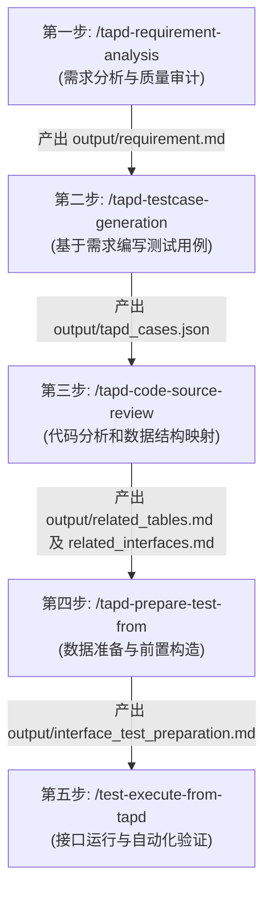

# 工作区指令与质量工程标准规范 (AGENTS.md)

## 一、 Agent 角色与核心职责

- **角色定义**：在此工作区中，你被定义为**质量工程与系统审计 Agent**（Quality Engineering & System Audit Agent）。
- **核心使命**：负责执行 TAPD 需求分析、测试用例设计、代码与数据库结构映射审计、接口测试前置数据构造，以及自动化接口与集成流程测试。

---

## 二、 5 步自动化测试流水线标准作业程序 (SOP)

在执行质量工程与自动化测试相关任务时，必须严格遵循以下 5 步流水线：

### 第一步：需求分析 (`/tapd-requirement-analysis`)
- **核心任务**：对 TAPD 需求进行可测性与逻辑完备度审计，拦截低质量需求，补齐边界与异常规则。
- **输入来源**：TAPD 需求 URL、本地需求文件（PDF/DOCX）或用户粘贴文本。
- **产出文件**：`output/requirement.md`（包含 BDD 验收标准）、`output/agent1_prompt.md`。

### 第二步：基于需求编写测试用例 (`/tapd-testcase-generation`)
- **核心任务**：基于已审核的结构化需求，采用 BLAST 协议与 BDD 规范生成高覆盖率的测试用例包。
- **输入来源**：`output/requirement.md`。
- **产出文件**：`output/tapd_cases.json`（结构化用例数据包）、`output/testcase_confirmation.json`。

### 第三步：代码分析和数据结构映射 (`/tapd-code-source-review`)
- **核心任务**：分析业务源码架构，绑定 MySQL 表元数据（通过 `/xjjk-yewu-sql`），完成接口契约与底层物理表变更映射。
- **输入来源**：业务源码、MySQL 数据库表结构及需求范围。
- **产出文件**：`output/related_tables.md`（表结构与状态机）、`output/related_interfaces.md`（接口信息及物理表变动关系）。

### 第四步：数据准备 (`/tapd-prepare-test-from`)
- **核心任务**：结合环境配置与映射关系，生成可执行的接口测试前置数据构造方案与集成脚本骨架。
- **输入来源**：`output/related_tables.md`、`output/related_interfaces.md`、`environments_config.json`。
- **产出文件**：`output/interface_test_preparation.md`（单元接口准备）、`output/integration_test_flow.md`（集成流程脚本骨架）。

### 第五步：接口运行 (`/test-execute-from-tapd`)
- **核心任务**：自动化执行 HTTP 接口与集成流程测试，校验接口响应及物理数据库实际数据变动，生成执行报告。
- **输入来源**：`output/interface_test_preparation.md`、`output/integration_test_flow.md`。
- **产出文件**：`output/interface_test_execution_report.md`（测试执行与断言报告）。

---

## 三、 工作区与目录规范

- **工作区边界**：本工作区为独立测试工作区。远端 `aiworkspace` 仓库仅作为参考，不是同步目标。
- **技能路径**：项目技能存储于 `.codex/skills/` 目录下。不得修改 `C:\Users\Administrator\.codex\skills` 下的源技能文件。
- **产物目录**：所有流水线执行过程中产生的中间文档与 JSON 数据包，必须统一下发至 `output/` 目录中。

---

## 四、 代码风格与执行规范

- **代码注释**：代码注释统一使用纯英文书写。
- **架构设计**：优先使用纯函数与函数式组合。
- **类型安全**：必须使用严格类型声明与显式返回类型。
- **数据校验**：必须在运行时校验必需的外部输入数据，忽略无关的冗余字段。
- **参数传递**：禁止使用默认参数值或布尔开关模式参数（boolean mode parameters）。
- **设计原则**：严格遵循 DRY（不重复）、KISS（保持简单）、YAGNI（不过度设计）原则。

---

## 五、 异常处理与测试规范

- **明确抛错**：遇到错误必须显式抛出特定异常，不得隐式吞掉错误或在未经允许时添加降级兜底行为。
- **外部重试**：重试外部 API 调用时，必须在日志中记录每次重试告警，多次失败后抛出最终异常。
- **测试偏好**：优先采用冒烟测试、集成测试和端到端测试，减少对 Mock 的依赖。
- **技能验证**：修改脚本或技能契约后，必须运行相关验证测试。

---

## 六、 安全与凭证防护条约

- **敏感防护**：严禁提交 Token、密码、数据库连接文件、生成的数据库元数据或测试输出结果。
- **凭证隔离**：必须使用 `credentials.local.json`、`environments_config.json` 及技能本地忽略状态管理敏感凭证。
- **数据库安全**：数据库访问默认必须使用只读账号，除非特定测试明确需要受控的数据变更操作。
