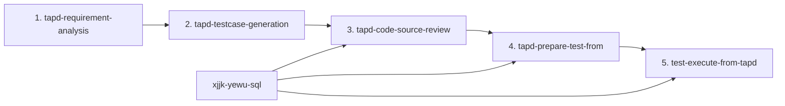

# XJJK Test AI Workspace

这是一个独立的质量工程与自动化测试 AI 工作区，用于从 TAPD 需求出发，完成需求审计、测试用例设计、代码与数据库证据映射、真实测试数据准备，以及 HTTP 接口和核心流程执行。

远程 `aiworkspace` 仓库仅用于参考目录组织。本工作区不与其自动同步，也不应把本地凭证、数据库数据、测试结果或临时文件提交到远程仓库。

## 核心原则

- **证据驱动**：HTTP Method、完整网关路径、DTO 字段、数据库表和断言必须来自需求、源码注解、代码审查或真实数据库元数据。
- **人工 Gate**：需求质量、用例审批、API 环境、数据库连接、Token 和代码复审批次均有明确的人工作业边界。
- **真实数据**：正向测试优先复用测试环境中的真实数据；没有数据时创建真实数据，禁止 Mock、Fake、Stub 和 Mock seed。
- **受控写入**：允许在明确的测试环境中通过真实业务 API 或受控 SQL 创建数据，但必须配置隔离标识、写入白名单和清理动作。
- **防篡改执行**：准备完成后锁定 assessment 哈希、测试用例哈希和代码复审批次；执行阶段不会自行改写 HTTP 方法、路径、断言或数据准备动作。
- **失败可见**：缺少证据、权限或环境能力时明确失败，不静默降级，不使用 Fallback 数据掩盖问题。

## 五步测试流水线



| 阶段 | Skill | 主要职责 | 核心产物 |
|---|---|---|---|
| 1 | `tapd-requirement-analysis` | 审计需求的可测性和逻辑完整度，整理 BDD 验收标准与疑问点 | `output/requirement.md` |
| 2 | `tapd-testcase-generation` | 基于已通过需求分析的内容生成 BLAST 测试矩阵和 TAPD 用例数据 | `output/test_cases.md`、`output/tapd_cases.json`、`output/latest/testcase_confirmation.json` |
| 3 | `tapd-code-source-review` | 拉取并审查业务源码，确认接口契约、调用链、DTO、网关路由和物理表证据 | `output/code_review/latest/unit_test_interfaces.md`、`core_process_interfaces.md`、`table_information.md`、`evidence_index.json` |
| 4 | `tapd-prepare-test-from` | 查询并选择真实数据，规划必要的真实数据创建和清理动作，生成不可变执行计划 | `output/test_preparation/preparation_assessment.json`、`output/test_execution/execution_plan.json`、测试准备文档和数据台账 |
| 5 | `test-execute-from-tapd` | 校验不可变计划，执行 setup、HTTP 请求、数据库断言、核心流程和 cleanup | `output/interface_test_execution_report.md`、`core_flow_test_execution_report.md`、更新后的数据台账 |

`xjjk-yewu-sql` 是辅助能力，不是独立流水线阶段。它负责登记 MySQL 连接、刷新表结构缓存，并为代码审查、数据准备和数据库断言提供真实元数据。

## 各 Skill 的职责边界

### `tapd-requirement-analysis`

- 接收 TAPD 需求 URL、本地 PDF/DOCX 或用户提供的需求文本。
- 保留需求原意，推断内容必须明确标注并进入疑问点。
- 需求质量低于门禁分数时暂停，等待补充信息或用户明确带警告放行。
- 需求阶段不猜测接口字段、HTTP Method 和数据库列。

### `tapd-testcase-generation`

- 只读取已经通过需求质量门禁的结构化需求。
- 使用 Given-When-Then 描述前置条件、行为和可验证结果。
- 疑问点覆盖的功能不擅自拍板，转入问题清单。
- 生成的用例必须经过人工审批，审批未通过时不得进入后续数据准备。

### `tapd-code-source-review`

- 根据测试用例范围过滤代码和表，不输出无关接口与表。
- HTTP Method 只能来自 `@GetMapping`、`@PostMapping` 等真实注解。
- Controller 路径必须与网关前缀拼接成完整调用路径。
- `@RequestBody` DTO 必须展开字段树。
- 代码逻辑缺失、接口不明确或证据冲突时立即 Halt。

### `tapd-prepare-test-from`

- 校验用例审批、代码审查批次、输入哈希、API 环境和数据库平台。
- 使用用户确认的只读连接查询真实测试数据。
- 生成结构化 `data_preparation`、接口请求、数据库断言和核心流程。
- 生成唯一的 `execution_plan.json`，后续执行阶段只能消费这份计划。
- 不执行正式测试。自动 HTTP/SQL setup 在第五步开始时执行；人工创建可以在本阶段完成，但必须重新查询确认真实记录。

详细契约见：

- [准备工作流](.codex/skills/tapd-prepare-test-from/references/execution-workflow.md)
- [准备评估数据契约](.codex/skills/tapd-prepare-test-from/references/assessment-contract.md)
- [本地配置契约](.codex/skills/tapd-prepare-test-from/references/configuration.md)

### `test-execute-from-tapd`

- 校验 `approved=true`、API 环境、数据库连接和不可变执行计划。
- 从当前 assessment 重建规范计划并完整比较，禁止执行被手工改写的计划。
- 先执行真实数据 setup，再执行单接口与核心流程，最后在 `finally` 中执行 cleanup。
- 测试失败、执行异常或 Token 失效时仍尝试清理。
- 清理失败时把记录标记为 `residual`，返回失败，不伪造已清理状态。

详细契约见 [执行计划契约](.codex/skills/test-execute-from-tapd/references/execution-plan-contract.md)。

## 真实测试数据策略

第四步必须按以下顺序处理正向用例所需数据：

1. **复用真实数据**：通过只读 `SELECT` 查找满足条件的现有测试数据。
2. **真实 API 创建**：没有可用数据时，优先使用有源码证据的真实业务接口创建。
3. **受控 SQL 创建**：没有稳定 API，且直接写表不会绕过被测行为时，允许使用用户单独确认的受控写连接执行参数化 `INSERT`。
4. **人工创建后复查**：无法安全自动化时输出人工步骤；人工完成后必须重新查询并确认记录存在。
5. **阻断**：只有无法安全创建、无法可靠清理或缺少证据时才标记为 `blocked`。

### 新增、修改和删除功能的区别

- **新增功能测试**：不要预先创建本次要由被测接口创建的目标对象，只准备租户、用户、商品等真实上游依赖。
- **修改或状态流转测试**：可以预先创建带 `TEST_` 隔离标识的真实目标对象。
- **删除功能测试**：可以预先创建真实目标对象；如果被测接口已经删除目标，cleanup 影响 0 行可以视为安全完成。

### 受控 SQL 限制

- Setup 只允许显式列、带参数的单条 `INSERT`。
- Cleanup 只允许按单一 `TEST_` 标识精确匹配或前缀匹配的参数化单条 `DELETE`。
- 禁止 `UPDATE`、DDL、存储过程、`TRUNCATE`、无条件 `DELETE`、文件导出、锁操作和注释 SQL。
- SQL setup 失败时事务回滚。
- 每个自动 setup 必须有对应 cleanup，cleanup 按反向顺序执行。

所有查询、创建、清理和残留数据统一写入 `output/test_data_manifest.md`，基本格式为：

```text
库名:表名:【JSON】
```

## 防篡改执行机制

第四步生成 `output/test_execution/execution_plan.json` 时会绑定：

- `preparation_assessment_sha256`：准备评估原始文件的 SHA-256。
- `testcase_hash`：人工审批用例的哈希。
- `code_review_run_id`：本次代码复审批次。

第五步执行前会：

1. 重新计算 assessment SHA-256。
2. 比较执行计划、准备评估和审批文件中的用例哈希与代码复审批次。
3. 使用准备 Skill 中相同的构建函数重新生成规范计划。
4. 对完整计划逐字段比较。

以下任何内容在准备后被修改都会阻断执行：

- 数据 setup 和 cleanup。
- HTTP Method 和完整路径。
- Header、Query、Body。
- 响应断言和数据库断言。
- 核心流程顺序和跨步骤依赖。

旧版本 assessment 或执行计划缺少 `data_preparation`、`data_setup`、`data_cleanup` 时不会自动修补，必须从第四步重新生成。

## 人工 Gate

| Gate | 触发阶段 | 必须确认的内容 |
|---|---|---|
| 需求质量 Gate | 第一步 | 需求质量达标，或用户明确接受带警告放行 |
| 用例审批 Gate | 第四步之前 | `testcase_confirmation.json.approved` 严格为 `true` |
| 代码复审 Gate | 第四、五步 | `code_review_run_id` 与当前审批文件一致 |
| API 环境 Gate | 第四、五步 | 用户从环境列表中明确选择一个环境 |
| 数据库平台 Gate | 第三、四、五步 | 用户明确选择只读连接；需要 SQL 写入时另行确认受控写连接 |
| Token Gate | 第四、五步 | Token 有效、租户无歧义；失效且无法重新登录时暂停 |
| 数据变更 Gate | 第五步 | `environment_type=test` 且 `allow_test_data_mutation=true` |

即使列表中只有一个环境或数据库连接，也不得自动替用户选择。

## 目录结构

```text
config/                         本地环境、凭证和数据库连接配置
.codex/skills/                  本工作区使用的项目 Skill
output/                         当前需求的全部流水线产物
scratch/                        临时脚本、诊断文件和快照
services/                       可选的后端源码工作目录
frontends/                      可选的前端源码工作目录
system-context/                 可复用的业务与系统上下文
knowledge/                      可复用的测试经验和规则记录
requirements-workflow.txt       工作流 Python 依赖
AGENTS.md                       工作区执行规则和质量工程规范
```

所有正式流水线产物必须写入 `output/`。临时文件放入 `scratch/`，不要把临时执行脚本混入 Skill 或业务源码目录。

## 初次配置

### 1. 安装依赖

建议使用项目虚拟环境：

```powershell
python -m venv .venv
.\.venv\Scripts\python.exe -m pip install -r requirements-workflow.txt
.\.venv\Scripts\python.exe -m playwright install chromium
```

如果工作区已经有可用的项目 Python 环境，继续使用现有环境，不要全局安装依赖。

### 2. 配置本地凭证

在 `config/credentials.local.json` 中维护 TAPD、测试环境账号和 Token。该文件已加入 `.gitignore`。

凭证只允许保存在本地配置中，不得写入：

- Skill 源码或测试代码。
- `execution_plan.json`。
- Markdown 报告或数据台账。
- 日志和 Git 跟踪文件。

### 3. 配置 API 环境

`config/environments_config.json` 只保存非敏感环境元数据。需要执行数据 setup 时，环境必须明确声明为测试环境：

```json
{
  "environments": [
    {
      "name": "测试环境名称",
      "api_domain": "https://api.example.test",
      "environment_type": "test",
      "allow_test_data_mutation": true,
      "credentials_ref": "environments.example-test"
    }
  ]
}
```

生产环境或未显式允许数据变更的环境不能运行 setup/cleanup。

### 4. 配置数据库连接

`config/connections.json` 是本工作区唯一数据库连接注册表。只读连接和受控写连接必须分开声明：

```json
{
  "connections": [
    {
      "name": "测试只读",
      "host": "LOCAL_ONLY",
      "port": 3306,
      "username": "LOCAL_ONLY",
      "password": "LOCAL_ONLY",
      "enabled": true,
      "access_mode": "read-only"
    },
    {
      "name": "测试受控写入",
      "host": "LOCAL_ONLY",
      "port": 3306,
      "username": "LOCAL_ONLY",
      "password": "LOCAL_ONLY",
      "enabled": true,
      "access_mode": "controlled-write",
      "environment_name": "测试环境名称",
      "allowed_databases": ["测试库"],
      "allowed_tables": ["允许构造数据的表"]
    }
  ]
}
```

受控写连接必须绑定同一测试环境并配置库表白名单。执行器不会根据环境名、历史记录或表名自动猜测连接。

## 日常使用方式

推荐按顺序在 Codex 中调用项目 Skill：

```text
/tapd-requirement-analysis
/tapd-testcase-generation
/tapd-code-source-review
/tapd-prepare-test-from
/test-execute-from-tapd
```

每一步完成后先检查产物和 Gate 状态，再进入下一步。不要绕过第四步直接为第五步手写执行计划，也不要从 Markdown 临时拼接 HTTP 请求。

第五步实际调用的执行器命令由 Skill 生成并校验，基本形式如下：

```powershell
python .codex/skills/test-execute-from-tapd/scripts/run_test_execution.py `
  --workspace . `
  --plan output/test_execution/execution_plan.json `
  --assessment output/test_preparation/preparation_assessment.json `
  --confirmation output/latest/testcase_confirmation.json `
  --environment-config config/environments_config.json `
  --environment-name "<用户确认的环境名称>" `
  --connections config/connections.json `
  --read-connection-name "<需要数据库断言时确认的只读连接>" `
  --write-connection-name "<需要受控 SQL 时另行确认的写连接>" `
  --output-dir output `
  --manifest output/test_data_manifest.md
```

没有数据库断言时不需要传只读连接；没有 SQL setup/cleanup 时不需要传受控写连接。

## 执行结果

测试步骤使用以下状态：

- `PASS`：请求和全部断言通过。
- `FAIL`：请求已执行，但至少一个断言不通过。
- `EXECUTION_ERROR`：网络、配置、数据库或运行时错误导致无法完成断言。
- `NOT_EXECUTED`：核心流程前序步骤失败，当前步骤未执行。

常用退出码：

- `0`：全部执行成功，cleanup 成功。
- `1`：存在断言失败、流程中断或 cleanup 失败。
- `2`：前置契约、配置、哈希、权限或执行环境错误。
- `10`：Token 失效，需要人工更新凭证或处理登录问题。

## Browser、Minium 和 Lane 的扩展方向

当前 `test-execute-from-tapd` 是通用 HTTP 接口执行器，只负责 HTTP、真实数据 setup/cleanup 和只读数据库断言。

以下能力不应直接塞入当前执行器：

- 浏览器 UI 自动化。
- Minium 小程序自动化。
- Lane 测试泳道创建、绑定和释放。

出现真实需求后，按能力分别增加独立 Skill：

```text
test-execute-browser-from-tapd   浏览器测试
test-execute-minium-from-tapd    小程序测试
test-lane-control                Lane 生命周期管理
```

只有当一个业务流程确实需要同时调用 HTTP、浏览器、小程序和 Lane 时，再增加 `test-flow-orchestrator` 统一编排。编排 Skill 只负责步骤顺序、参数传递、失败中断和最终清理，不实现各执行器内部逻辑。

当前工作区尚未创建这些扩展 Skill，也没有在 HTTP 执行器中预埋 `browser_mode`、`use_minium` 或 `lane_enabled` 等开关，避免在缺少真实用例时过度设计。

## 安全与 Git 规则

- `config/credentials.local.json`、`config/environments_config.json` 和 `config/connections.json` 均为本地文件，不得提交。
- `output/`、`scratch/`、数据库缓存、Playwright 缓存和测试报告默认由 `.gitignore` 排除。
- 不提交 Token、账号、密码、数据库连接或真实测试结果。
- 未经用户明确要求，不创建 Git Commit。
- 不修改 `C:\Users\Administrator\.codex\skills` 下的全局 Skill；本项目 Skill 只维护在 `.codex/skills/`。

## 修改 Skill 后的验证

修改准备或执行 Skill 后，至少运行：

```powershell
python -m pytest .codex/skills/tapd-prepare-test-from/tests/test_skill_contracts.py -q
python -m pytest .codex/skills/test-execute-from-tapd/tests/test_run_test_execution.py -q
python -m compileall -q .codex/skills/tapd-prepare-test-from/scripts .codex/skills/test-execute-from-tapd/scripts
git --no-pager diff --check
```

并使用 `skill-creator/scripts/quick_validate.py` 分别校验两个 Skill 目录。

## 常见阻断原因

- 用例尚未人工审批，或 `approved` 不为 `true`。
- 测试用例哈希与审批文件不一致。
- 当前代码复审批次与准备计划不一致。
- HTTP Method、路径、DTO 或数据库字段缺少源码证据。
- 未明确选择 API 环境或数据库连接。
- Token 失效、租户选择有歧义或稳定登录定位信息缺失。
- 真实数据不存在，且无法安全创建或清理。
- 环境不是 `test`，或未启用 `allow_test_data_mutation`。
- 受控写连接没有配置正确的库表白名单。
- assessment 或执行计划在准备完成后被修改。

遇到阻断时应返回对应上游阶段补齐证据或重新生成产物，不要手工修改执行计划绕过校验。
